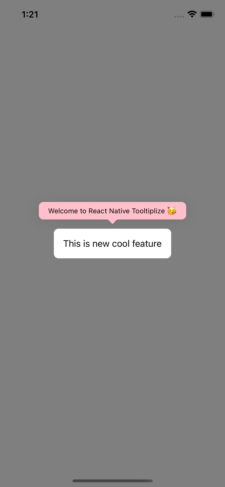
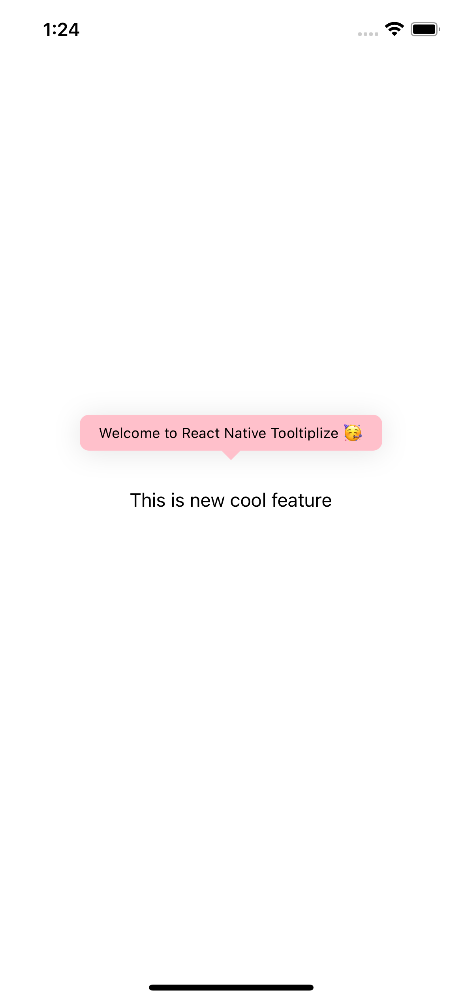
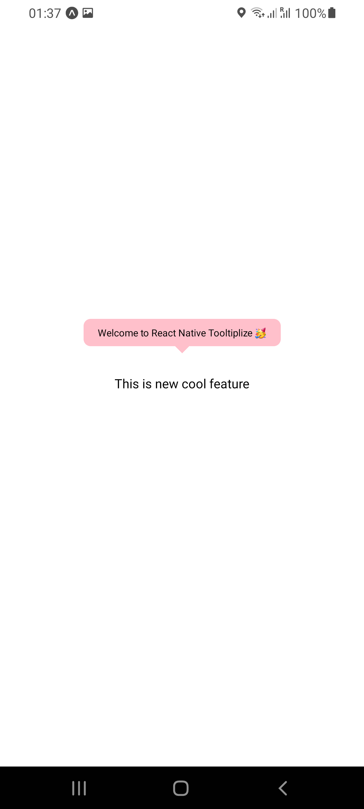
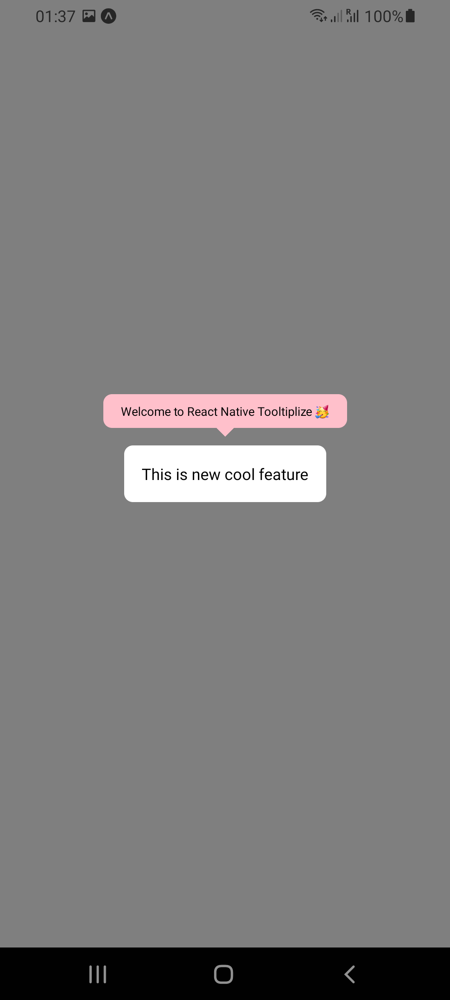

# `react-native-tooltiplize`

react native tooltip like never before, using leading packages like `react-native-reanimated` v2, `framer-motion`, and `@gorhom/portal`


## Preview

| With Overlay (iOS)                                          | Without Overlay (iOS)                                    | Without Overlay (Android)                                    | With Overlay (Android)                                    |
| ----------------------------------------------------------- | -------------------------------------------------------- | ------------------------------------------------------------ | --------------------------------------------------------- |
|  |  |  |  |

## Features

- iOS, Android, and Web!!!
- Fully customizable
- Simple and Clean API
- Works for all `reanimated`'s v2 versions
- Far away from `Modal` issues
- 60 FPS
- Less boilerplate
- RTL support by default (no need to worry about it)
- Built for already in production app
- And more...

## Installation

```bash
yarn add react-native-tooltiplize
```
#### Peer Dependencies

This library needs some peer dependencies to work properly. You need to install them in your project.

- for `react-native-cli` users:

  1. install peer dependencies:

     ```bash
     yarn add react-native-reanimated @gorhom/portal
     ```

  2. For iOS:

     ```bash
     cd ios && pod install
     ```

- for `expo` users:

```bash
npx expo install react-native-reanimated @gorhom/portal
```


## Usage

you first need to wrap your app with `PortalProvider` from `@gorhom/portal` to provide a context for the `Portal`.

```tsx
import { PortalProvider } from '@gorhom/portal';

const App = () => {
  return (
    <PortalProvider>
      <App />
    </PortalProvider>
  );
};
```
then you can use the `Tooltip` component

```tsx
import React from 'react';
import Tooltip from 'react-native-tooltiplize';
import { PortalProvider } from '@gorhom/portal';
import { View, TouchableOpacity, StyleSheet, Text } from 'react-native';

const App = () => {
  const [isVisible, toggle] = React.useReducer((state) => !state, false);

  const renderContent = React.useCallback(() => {
    return (
      <TouchableOpacity style={styles.tooltipContainer} onPress={toggle}>
        <Text style={styles.tooltipText}>
          Welcome to React Native Tooltiplize 🥳
        </Text>
      </TouchableOpacity>
    );
  }, []);

  return (
    <View style={styles.container}>
      <Tooltip
        position="top"
        offset={8}
        renderContent={renderContent}
        isVisible={isVisible}
        withOverlay
        onDismiss={toggle}
        pointerStyle={styles.pointer}
        pointerColor="green"
      >
        <TouchableOpacity onPress={toggle} style={styles.newFeature}>
          <Text style={styles.newFeatureText}>This is new cool feature</Text>
        </TouchableOpacity>
      </Tooltip>
    </View>
  );
};

export default App;

const styles = StyleSheet.create({
  container: {
    flex: 1,
    justifyContent: 'center',
    alignItems: 'center',
  },
  tooltipContainer: {
    paddingHorizontal: 16,
    paddingVertical: 8,
    borderRadius: 8,
    shadowColor: '#000',
    shadowOffset: {
      width: 0,
      height: 2,
    },
    shadowOpacity: 0.1,
    shadowRadius: 12,
    elevation: 5,
    backgroundColor: 'green',
  },
  tooltipText: {
    fontSize: 12,
    color: 'white',
  },
  pointer: { width: 16, height: 8 },
  newFeature: {
    backgroundColor: 'white',
    padding: 16,
    borderRadius: 8,
  },
  newFeatureText: {
    fontSize: 16,
  },
});
```


## Props

| ?   | Name            | Type                                 | Default             | Description                                                                                                                                                                                                                        |
| --- | --------------- | ------------------------------------ | ------------------- | ---------------------------------------------------------------------------------------------------------------------------------------------------------------------------------------------------------------------------------- |
| ✅   | `isVisible`     | `boolean`                            | `undefined`         | Determines whether the tooltip is visible or not.                                                                                                                                                                                  |
| ✅   | `renderContent` | `() => ReactNode`                    | `undefined`         | the content of the tooltip                                                                                                                                                                                                         |
| ✅   | `children`      | `ReactNode`                          | `undefined`         | the children component that the tooltip will point to                                                                                                                                                                              |
| ❌   | `withOverlay`   | `boolean`                            | `undefined`         | whether or not to render overlay behind the `children` and the `Tooltip`                                                                                                                                                           |
| ❌   | `onDismiss`     | `() => void`                         | `undefined`         | a function to be called when the user presses on the overlay                                                                                                                                                                       |
| ❌   | `overlayStyle`  | `ViewStyle`                          | `undefined`         | a style object to customize how `Overlay` looks                                                                                                                                                                                    |
| ❌   | `offset`        | `number`                             | `0`                 | a distance added between the `Tooltip` and the `children`, Please note that the `Pointer` size is calculated separately                                                                                                            |
| ❌   | `pointerStyle`  | `ViewStyle`                          | `undefined`         | a style object to customize `Pointer` looks, <br />Please note:  the only available styles in only `width` and `height`                                                                                                            |
| ❌   | `pointerColor`  | `string`                             | `"#000000"`         | The `Pointer`'s color                                                                                                                                                                                                              |
| ❌   | `position`      | `string`                             | `top`               | `top`, `bottom`, `left`, and `right`, to control the placement of the `Tooltip`                                                                                                                                                    |
| ❌   | `timingConfig`  | `WithTimingConfig`                   | `{ duration: 300 }` | the timing config for animating opening and closing of the `Tooltip` and `Overlay`, <br />Please note: that is from [`react-native-reanimated`](https://docs.swmansion.com/react-native-reanimated/docs/api/animations/withTiming) |
| ❌   | `childrenStyle` | `ViewStyle`                          | `undefined`         | the style of `children`                                                                                                                                                                                                            |
| ❌   | `renderPointer` | `(props: PointerProps) => ReactNode` | `undefined`         | a render function for the pointer component takes the pointer props that you pass them as a props                                                                                                                                  |


## TODO:

- [ ] Handle Safe Area and Window dimensions
- [ ] Adding Support for more animation types
- [ ] Unit Testing
- [ ] Adding Cool pointer using `react-native-svg` with optional dependencies


## Big Thanks 🙏

this package is heavily inspired from:

- [`react-native-portal`](https://github.com/gorhom/react-native-portal)

- [`react-native-triangle`](https://github.com/Jpoliachik/react-native-triangle)

- [`react-native-portalize`](https://github.com/jeremybarbet/react-native-portalize)


## Contributing

See the [contributing guide](CONTRIBUTING.md) to learn how to contribute to the repository and the development workflow.

## License

MIT

---

Made with [create-react-native-library](https://github.com/callstack/react-native-builder-bob)
